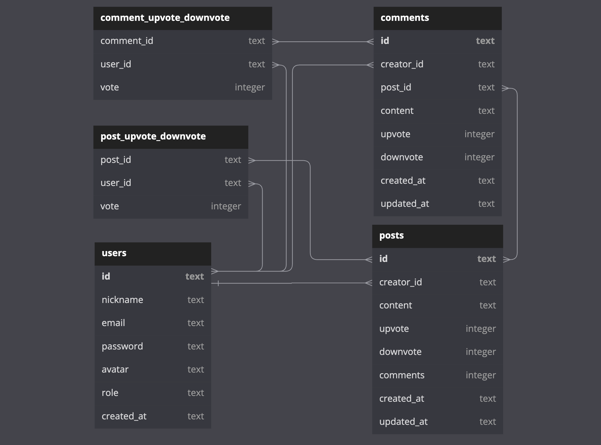

<h1 align="center"> LabEddit </h1>
<h3 align="center">BACKEND PROJECT</h3>
 

## 📝 Description

User management API, posts and interactions made on the social network LabEddit. It is an express server back-end application with SQLite3 database, where there is data protection and code organization based on layered architecture concepts. It aims to promote interaction between people through posts, likes and comments.

### DATABASE

https://dbdiagram.io/d/64038a44296d97641d856e92

## 📜 Documentation

[link]

## 🕹 Endpoints

- Login

USERS

- GET All Users;
- POST Create User;
- DEL Delete User;

POSTS

- GET All Posts;
- POST Create Post;
- PUT Edit Post;
- DEL Delete Post;
- PUT Like or Dislike.

## 🛠 Technologies

- NodeJS;
- Typescript;
- Express;
- SQLite;
- Knex;
- POO;
- Layered Architecture;
- UUID;
- Hashing Passwords;
- Tokens JWT;
- Authentication and Authorization;
- Routing;
- Postman.

## 👩‍💻 Author
Laís Rodrigues Macedo  
📧 laisrodriguesmacedo@gmail.com  
WhatsApp: (+49) 174 7781517